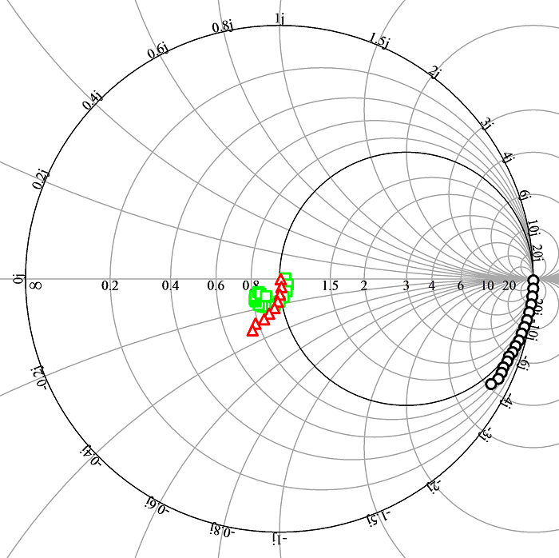
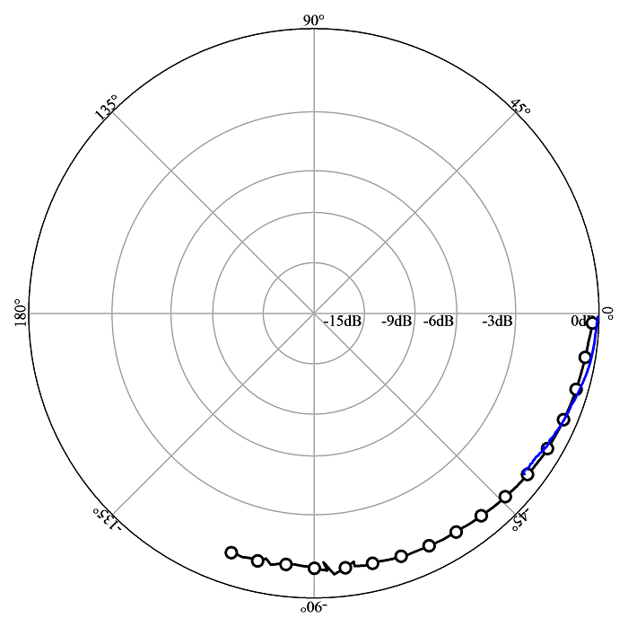

[InspectDR]: <https://github.com/ma-laforge/InspectDR.jl>

# WinSPP: Publication-quality <var>S</var>-parameter & polar plots

Generates publication-quality S-parameter plots & polar plots.  Plot are saved as an enanced Windows metafile (.emf file) that can be resized with no loss of quality.

## :heavy_exclamation_mark: Deprecation Warning

To a large part, WinSPP has been superseded by [InspectDR].  [InspectDR] has more control over plots, and is more portable than WinSPP.  Note, however, that WinSPP still has a few advantages for the moment:
 - Supports polar plots (sometimes useful for transmission coefficients).
 - Exports to .emf format: At the moment, .emf is easier to integrate into most Windows application (when compared to .svg).

## Sample Output (Click image to access .emf version)
### Smith Plot

### Polar Plot

## Features
### Two tools
- WinSPP: Simple graphical interface to load/preview/save plots.
- WinSPPcl: Even simpler command-line tool.

### Compensate for StarOffice Bug
Certain versions of StarOffice/OpenOffice (/LibreOffice?) incorrectly interpret the enhanced metafile text angle by a factor of -1.  This generates very unpleasant plots.  WinSPP can compensate for this issue:

- Check "Compensate for StarOffice bug" in WinSPP (gui).
- Use -fixso switch in WinSPPcl (command-line tool).

## Input File Format
[Click here for a description of the input file format.](doc/WinSPPInputFmt.md)

## WinSPPcl Command-Line Usage
	WinSPPcl.exe: Generates S-parameter/polar plot .emf files.

	Example:
	   WinSPPcl.exe [OPTIONS] [OUTPUT_FILE.emf] < [INPUT_FILE.plot]

	OPTIONS:
	   -h: Show this help.
	   -fixso: Compensates for StarOffice EMF text angle bug.

## Known Limitations
- Currently generates plots using the older 32-bit windows GDI interface.  As a result, the preview window does not leverage anti-aliasing effects.
- Does not support plot titles
- Does not support legends

## Compiling
WinSPP is currently provided as two small programs written in Visual Studio 2013.  It *should* be straightforward to compile with VS2013 by opening/building from the solution file: VisualStudio2013/WinSPP/WinSPP.sln.

## Disclaimer
This software is provided "as is", with no guarantee of correctness.  Use at own risk.

WinSPP was thrown together circa 2005 in order to produce publication-quality S-parameter plots.  It is an extremely bare bones plotting tool... but it seems to work.
